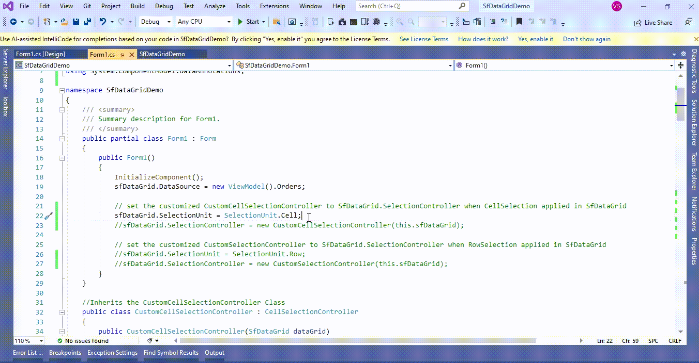
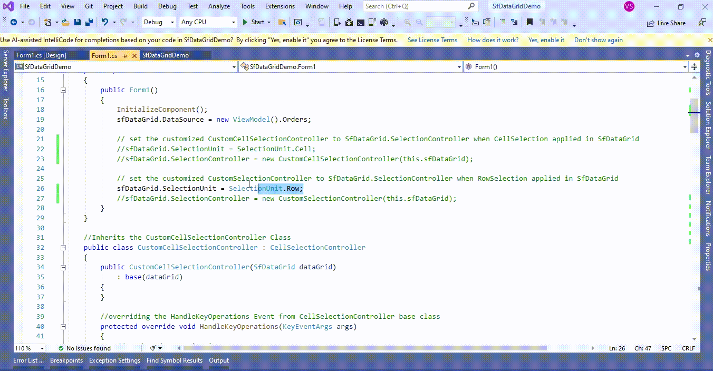

# How to change the PageUp and PageDown key behavior in WinForms DataGrid (SfDataGrid)?

## About the sample
This example illustrates how to change the PageUp and PageDown key behavior in [WinForms DataGrid](https://www.syncfusion.com/winforms-ui-controls/datagrid) (SfDataGrid)?

[WinForms DataGrid](https://www.syncfusion.com/winforms-ui-controls/datagrid) (SfDataGrid) when you press the **PageUp** or **PageDown** key will be scrolled to the previous set of rows or the next set of rows that are not displayed in the view. To change this behavior like **Tab** key navigation that moves the currentcell to next cell of the same row by overriding [CellSelectionController](https://help.syncfusion.com/cr/windowsforms/Syncfusion.WinForms.DataGrid.Interactivity.CellSelectionController.html) / [RowSelectionController](https://help.syncfusion.com/cr/windowsforms/Syncfusion.WinForms.DataGrid.Interactivity.RowSelectionController.html) class and setting it to [SfDataGrid.SelectionController](https://help.syncfusion.com/cr/windowsforms/Syncfusion.WinForms.DataGrid.SfDataGrid.html#Syncfusion_WinForms_DataGrid_SfDataGrid_SelectionController) property.

When [SelectionUnit](https://help.syncfusion.com/cr/windowsforms/Syncfusion.WinForms.DataGrid.SfDataGrid.html#Syncfusion_WinForms_DataGrid_SfDataGrid_SelectionUnit) is a [Cell](https://help.syncfusion.com/cr/windowsforms/Syncfusion.WinForms.DataGrid.Enums.SelectionUnit.html), you have to override [CellSelectionController](https://help.syncfusion.com/cr/windowsforms/Syncfusion.WinForms.DataGrid.Interactivity.CellSelectionController.html) and when [SelectionUnit](https://help.syncfusion.com/cr/windowsforms/Syncfusion.WinForms.DataGrid.SfDataGrid.html#Syncfusion_WinForms_DataGrid_SfDataGrid_SelectionUnit) is [Row](https://help.syncfusion.com/cr/windowsforms/Syncfusion.WinForms.DataGrid.Enums.SelectionUnit.html), you have to override [RowSelectionController](https://help.syncfusion.com/cr/windowsforms/Syncfusion.WinForms.DataGrid.Interactivity.RowSelectionController.html) class.

[WinForms DataGrid](https://www.syncfusion.com/winforms-ui-controls/datagrid) (SfDataGrid) is defined with [SelectionUnit](https://help.syncfusion.com/cr/windowsforms/Syncfusion.WinForms.DataGrid.SfDataGrid.html#Syncfusion_WinForms_DataGrid_SfDataGrid_SelectionUnit) as [Cell](https://help.syncfusion.com/cr/windowsforms/Syncfusion.WinForms.DataGrid.Enums.SelectionUnit.html). You can change the **PageUp** and **PageDown** key behavior by overriding the [HandleKeyOperations](https://help.syncfusion.com/cr/windowsforms/Syncfusion.WinForms.DataGrid.Interactivity.RowSelectionController.html#Syncfusion_WinForms_DataGrid_Interactivity_RowSelectionController_HandleKeyOperations_System_Windows_Forms_KeyEventArgs_) method in [CellSelectionController](https://help.syncfusion.com/cr/windowsforms/Syncfusion.WinForms.DataGrid.Interactivity.CellSelectionController.html) in [WinForms DataGrid](https://www.syncfusion.com/winforms-ui-controls/datagrid) (SfDataGrid).

```C#

// set the customized CustomCellSelectionController to SfDataGrid.SelectionController when CellSelection applied in SfDataGrid
sfDataGrid.SelectionUnit = SelectionUnit.Cell;
sfDataGrid.SelectionController = new CustomCellSelectionController(this.sfDataGrid);

//Inherits the CustomCellSelectionController Class
public class CustomCellSelectionController : CellSelectionController
{
        public CustomCellSelectionController(SfDataGrid dataGrid)
            : base(dataGrid)
        {
        }

        //overriding the HandleKeyOperations Event from CellSelectionController base class
        protected override void HandleKeyOperations(KeyEventArgs args)
        {
            //Key based Customization 
            if (args.KeyCode == Keys.PageUp || args.KeyCode == Keys.PageDown)
            {
                //assigning the state of Tab key Event handling to PageUp and PageDown key
                KeyEventArgs arguments = new KeyEventArgs(Keys.Tab);
                base.HandleKeyOperations(arguments);
                return;
            }

            base.HandleKeyOperations(args);
        }
}

```



[WinForms DataGrid](https://www.syncfusion.com/winforms-ui-controls/datagrid) (SfDataGrid) is defined with [SelectionUnit](https://help.syncfusion.com/cr/windowsforms/Syncfusion.WinForms.DataGrid.SfDataGrid.html#Syncfusion_WinForms_DataGrid_SfDataGrid_SelectionUnit) as [Row](https://help.syncfusion.com/cr/windowsforms/Syncfusion.WinForms.DataGrid.Enums.SelectionUnit.html). You can change the **PageUp** and **PageDown** key behavior by overriding the [HandleKeyOperations](https://help.syncfusion.com/cr/windowsforms/Syncfusion.WinForms.DataGrid.Interactivity.RowSelectionController.html#Syncfusion_WinForms_DataGrid_Interactivity_RowSelectionController_HandleKeyOperations_System_Windows_Forms_KeyEventArgs_) method in [RowSelectionController](https://help.syncfusion.com/cr/windowsforms/Syncfusion.WinForms.DataGrid.Interactivity.RowSelectionController.html) in [WinForms DataGrid](https://www.syncfusion.com/winforms-ui-controls/datagrid) (SfDataGrid).

```C#

// set the customized CustomSelectionController to SfDataGrid.SelectionController when RowSelection applied in SfDataGrid
sfDataGrid.SelectionUnit = SelectionUnit.Row;
sfDataGrid.SelectionController = new CustomSelectionController(this.sfDataGrid);

//Inherits the CustomSelectionController Class
public class CustomSelectionController : RowSelectionController
{
        public CustomSelectionController(SfDataGrid dataGrid)
            : base(dataGrid)
        {
        }

        //overriding the HandleKeyOperations Event from RowSelectionController base class
        protected override void HandleKeyOperations(KeyEventArgs args)
        {
            //Key based Customization 
            if (args.KeyCode == Keys.PageUp || args.KeyCode == Keys.PageDown)
            {              
                //assigning the state of Tab key Event handling to PageUp and PageDown key
                KeyEventArgs arguments = new KeyEventArgs(Keys.Tab);
                base.HandleKeyOperations(arguments);
                return;               
            }

            base.HandleKeyOperations(args);
        }
}

```



Take a moment to peruse the [WinForms DataGrid – Selection](https://help.syncfusion.com/windowsforms/datagrid/selection) documentation, where you can find about selection with code examples.

## Requirements to run the demo
Visual Studio 2015 and above versions
